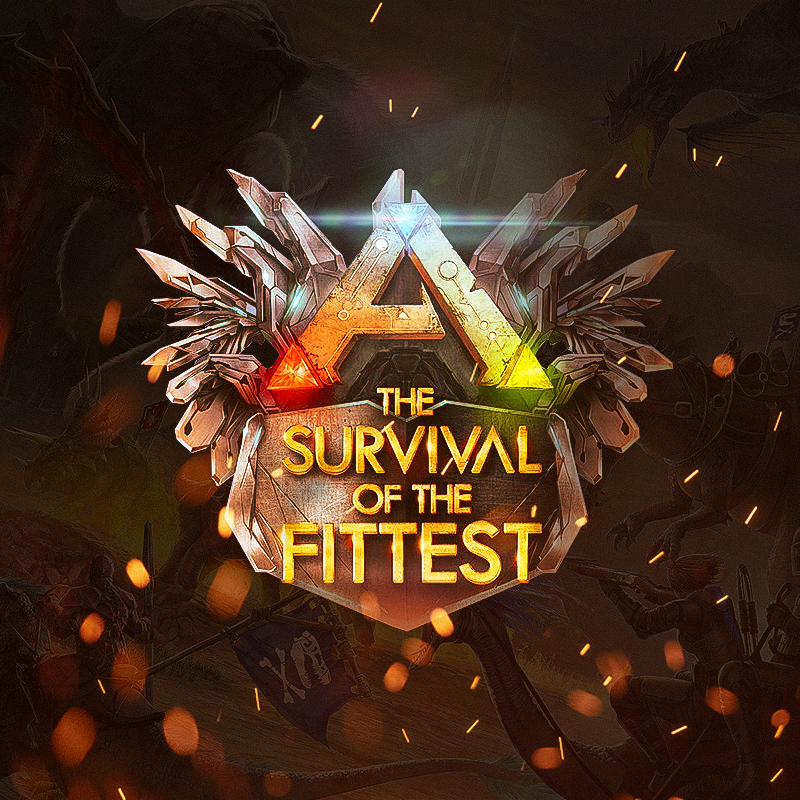

# ark-sotf-discord-bot

The Survival Of The Fittest Bot for [ARK: The Survival Of The Fittest](https://discord.gg/playSOTF) Discord server.

<p align="center">
  <a href="https://discord.gg/playSOTF">
    
  </a>
</p>

[Discord Documentation](https://discord.com/developers/applications).

[Discord.js Documentation](https://discord.js.org/) and [Discord.js Guide](https://discordjs.guide/).

## Prerequisites

- [Node.js](https://nodejs.org/) >= 18.0.0
- [npm](https://www.npmjs.com/) >= 8.0.0

### Installation

```sh
# Configure environment variables
cp .env.example .env

# Install
npm clean-install
```

## Usage

```sh
# Register commands for `DISCORD_GUILD_ID` provided in `.env`
npm run discord:register-commands

# Run Discord bot
npm run build
npm run start
```

## Usage with Docker

```sh
docker build --tag="ark-sotf-discord-bot" ./
docker run --env-file=".env" --init --interactive --rm "ark-sotf-discord-bot"
```
